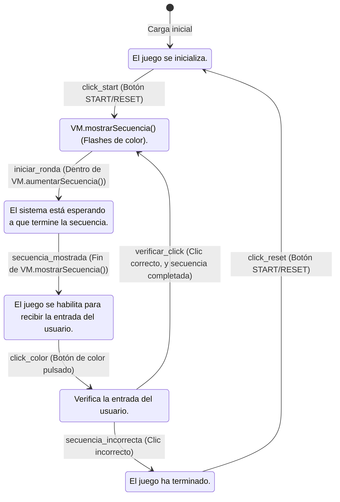

# SimonDice

#### En este repositorio voy a realizar un juego en Kotlin ####

---

## `Tabla estados` ##

| Desde Estado | A Estado     | Acción                                   | Función / Lógica Resultante                                                                 |
|---------------|--------------|-----------------------------------------------------------|----------------------------------------------------------------------------------------------|
| [∗]           | INICIO       | Carga inicial                                            | El juego se inicializa.                                                                      |
| INICIO        | SECUENCIA    | click_start (Botón START/RESET)                          | Llama a `VM.inicializaJuego();` comienza la secuencia.                                       |
| SECUENCIA     | ESPERANDO    | iniciar_ronda (Dentro de `VM.aumentarSecuencia()`)       | El ViewModel (VM) empieza a mostrar la secuencia: `VM.mostrarSecuencia()` (flashes de color). |
| ESPERANDO     | ENTRADA      | secuencia_mostrada (Fin de `VM.mostrarSecuencia()`)      | La secuencia se ha terminado de mostrar. El juego se habilita para recibir la entrada del usuario. |
| ENTRADA       | COMPROBANDO  | click_color (Botón de color pulsado)                     | Llama a `VM.aumentarSecuenciaUsuario()` para registrar la entrada del usuario.               |
| COMPROBANDO   | SECUENCIA    | verificar_click (Clic correcto, y secuencia completada)  | El juego avanza a la siguiente ronda, añadiendo un nuevo color a la secuencia.               |
| COMPROBANDO   | FINALIZADO   | secuencia_incorrecta (Clic incorrecto)                   | El juego termina inmediatamente.                                                             |
| FINALIZADO    | INICIO       | click_reset (Botón START/RESET)                          | Reinicia el juego al estado inicial.                                                         |

---

## `Diagrama estados` ##

