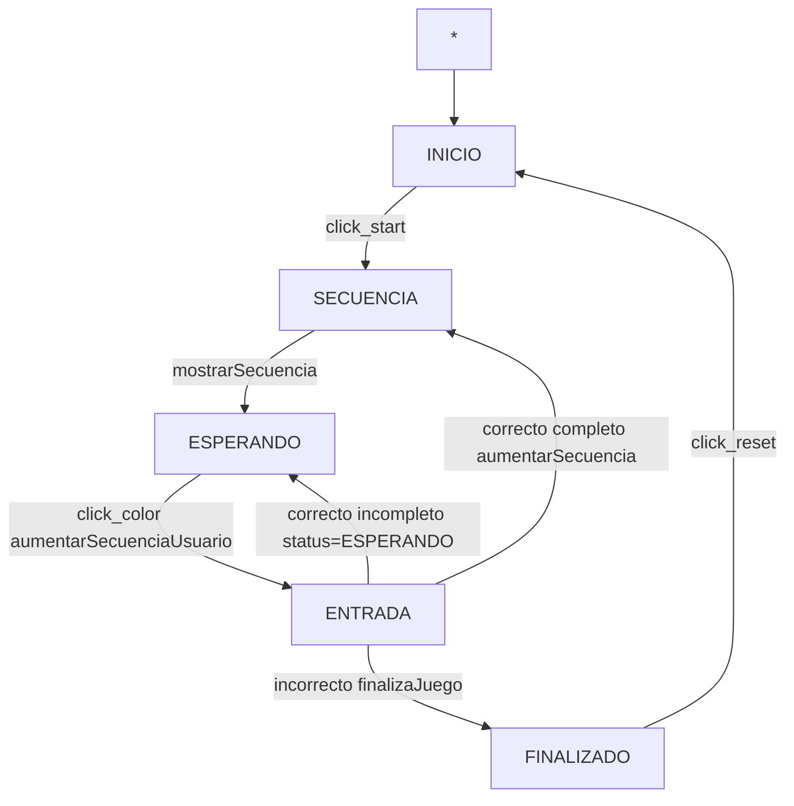
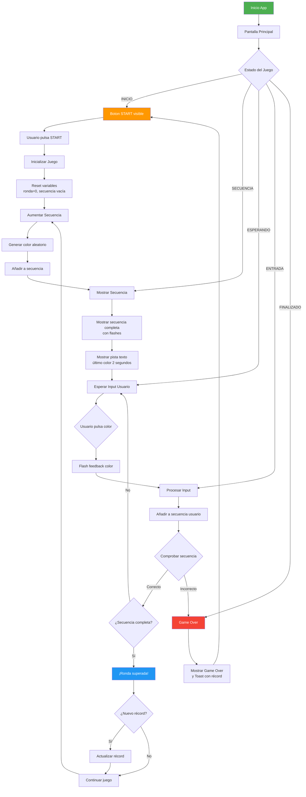

# SimonDice

#### En este repositorio voy a realizar un juego en Kotlin ####

---

## `Diagrama estados` ##

```mermaid

flowchart TD
    A[*] --> B[INICIO]
    B -->|click_start| C[SECUENCIA]
    C -->|mostrarSecuencia| D[ESPERANDO]
    D -->|click_color aumentarSecuenciaUsuario| E[ENTRADA]
    E -->|correcto incompleto status=ESPERANDO| D
    E -->|incorrecto finalizaJuego| F[FINALIZADO]
    F -->|click_reset| B
    E -->|correcto completo aumentarSecuencia| C

```

---

## `Diagrama flujo` ##

```mermaid
flowchart TD
    A[Inicio App] --> B[Pantalla Principal]
    B --> C{Estado del Juego}
    
    C -->|INICIO| D[Boton START visible]
    C -->|SECUENCIA| E[Mostrar Secuencia]
    C -->|ESPERANDO| F[Esperar Input Usuario]
    C -->|ENTRADA| G[Procesar Input]
    C -->|FINALIZADO| H[Game Over]
    
    D --> I[Usuario pulsa START]
    I --> J[Inicializar Juego]
    J --> K[Reset variables<br/>ronda=0, secuencia vacía]
    K --> L[Aumentar Secuencia]
    
    L --> M[Generar color aleatorio]
    M --> N[Añadir a secuencia]
    N --> E
    
    E --> O[Mostrar secuencia completa<br/>con flashes]
    O --> P[Mostrar pista texto<br/>último color 2 segundos]
    P --> F
    
    F --> Q{Usuario pulsa color}
    Q --> R[Flash feedback color]
    R --> G
    
    G --> S[Añadir a secuencia usuario]
    S --> T{Comprobar secuencia}
    
    T -->|Correcto| U{¿Secuencia completa?}
    T -->|Incorrecto| H
    
    U -->|No| F
    U -->|Sí| V[¡Ronda superada!]
    
    V --> W{¿Nuevo récord?}
    W -->|Sí| X[Actualizar récord]
    W -->|No| Y[Continuar juego]
    X --> Y
    Y --> L
    
    H --> Z[Mostrar Game Over<br/>y Toast con récord]
    Z --> D
    
    %% Estilos
    style A fill:#4CAF50,color:white
    style H fill:#f44336,color:white
    style V fill:#2196F3,color:white
    style D fill:#FF9800,color:white
```

